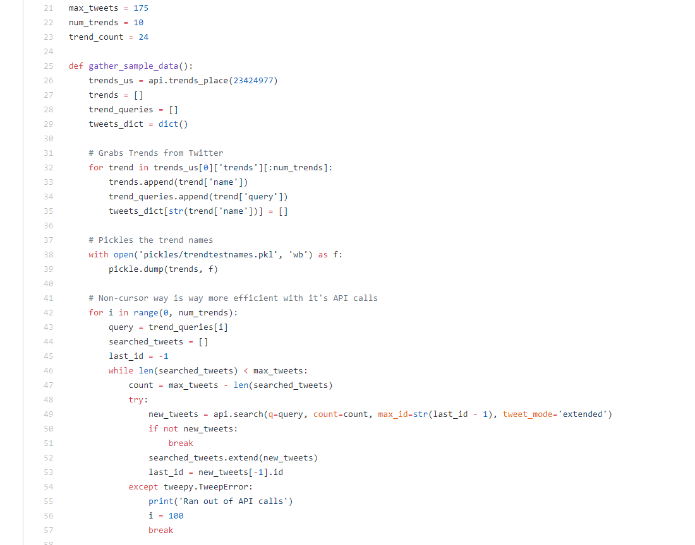
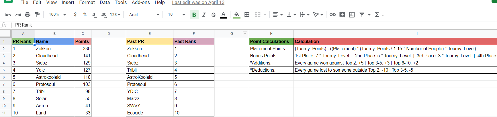
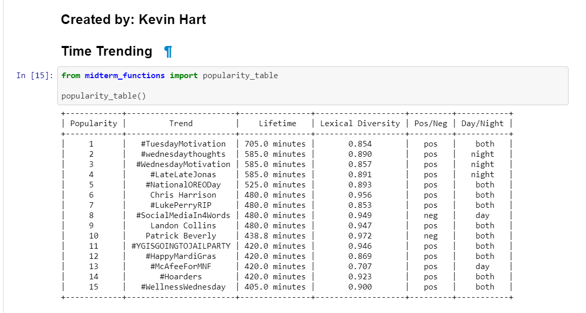

# WebAppsWebPage
A web page about me

## Projects
Some of the projects that I have done include:
- [Twitter Trend Summarizer](https://github.com/KHart0012/TwitterSummarizer) 

- [Smash PR Ranking Generator](https://github.com/KHart0012/SmashPowerRankingGenerator)

- [Twitter Differences Between Day/Night Trends](https://github.com/KHart0012/random-stuff)

## Favorite Programming Languauges (Currently)
1. Python
2. C/C++
3. Java
